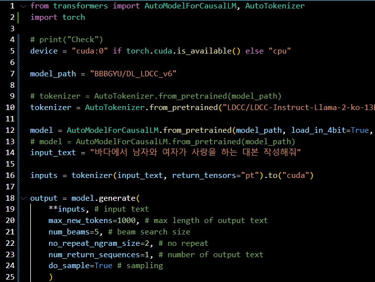
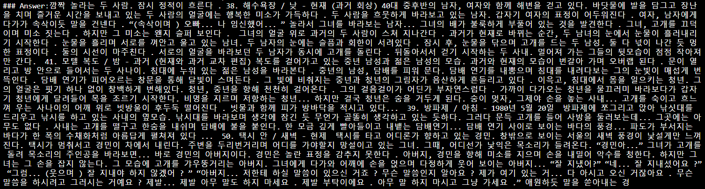
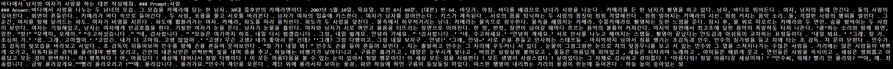
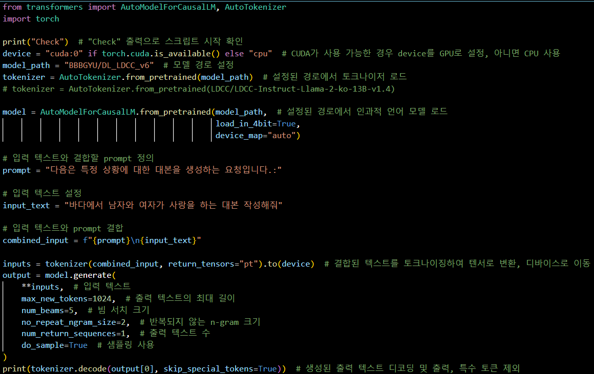

# LLM 프로젝트 결과보고서

## 프로젝트 개요

- **프로젝트 명:** 사건 시뮬레이션 시스템 > 감정기반 대본작성 시스템
- **프로젝트 기간:** 2023.08.29 ~ 2023.12.12
- **프로젝트 목적:** 창작 분야에서 AI의 활용을 통해 창작 과정 혁신 및 작업 효율성 증대
- **프로젝트 참여자:** 이규범 202221014

## 데이터 수집

- **데이터 수집 소스:** 게임 스토리, 소설, 라이트 노벨, 영화 대본 등의 다양한 창작 콘텐츠
- **데이터 양과 형식:** 나무위키에서 수집한 게임 스토리, 무료 소설 사이트에서 얻은 소설의 내용, 영화 대본등 총 hwp파일로 200종류를 구하여 전처리 하였다.

## 모델 설계

- **사용한 LLM 모델:** LDCC/LDCC-Instruct-Llama-2-ko-13B-v1.4
- **모델 튜닝:** LDCC/LDCC-Instruct-Llama-2-ko-13B-v1.4 모델을 NEFTune noise embeddings 및 Direct Preference Optimization (DPO)을 활용하여 fine-tuning하였다.
- **하이퍼파라미터:** 
  - Learning Rate: 2E-4
  - Batch Size: 1
  - Epochs: 4
  - Block Size: 1024
  - Warmup Ratio: 0.1
  - Weight Decay: 0.01
  - Gradient Accumulation: 4
  - 사용된 기타 하이퍼파라미터 및 설정을 여기에 추가하세요.
- **모델 아키텍처:** beomi/llama-2-koen-13b

## 실험 및 결과

- **실험 환경:** 실험은 다음과 같은 컴퓨터 환경에서 수행되었습니다.
  - GPU: NVIDIA A100-SXM4-40GB
  - 드라이버 버전: 450.80.02
  - CUDA 버전: 11.8

- **실험 과정:** 실험은 다음과 같은 과정으로 진행되었습니다.
  1. 데이터 전처리: 수집한 텍스트 데이터(대본, 스토리, 소설)를 정제하고 모델 학습에 적합한 형식으로 가공했다.
     - 수집한 데이터를 hwp파일로 모두 다운로드 받은 후 하나의 파일에 pdf형태로 저장한다.
     - #씬, #scene, #32 등 학습에 불필요한 장면전환 단어들을 모두 제거한다.
     - 감정을 읽기 위하여 감정과 관련된 단어를 약 5천가지 선정하여 분리한다.
     - 정리된 데이터를 학습모델에 사용할 수 있도록 prompt Template에 맞춰 정리한다.

---

### Prompt Template 예시
  #### Prompt:
  {instruction}

  #### Answer:
  {output}

---

  2. 모델 학습: LDCC/LDCC-Instruct-Llama-2-ko-13B-v1.4 모델을 직접 만든 데이터셋을 사용하여 fine-tuning하였다.

  3. 성능 평가: 글을 잘 작성했다는 평가를 수치적으로 표현하기엔 어려움이 있어서, 직접 완성된 글을 읽고 자연스러운 글이 작성됐는지, 주제에 대한 글을 작성했는지 판단하였다.
  
  4. 실험 내용
     처음 코드를 작동하였을때 LDCC의 모델이 너무 많은 RAM을 사용하여 GPU의 RAM이 부족하여 코드가 동작하지 않았다. 따라서 코드를 수정하여 모델을 4비트 정밀도로 로드하여 메모리 사용량을 대폭 줄였다.

---
#### 기존 코드
model = AutoModelForCausalLM.from_pretrained(model_path)

#### 변경 코드
model = AutoModelForCausalLM.from_pretrained(model_path, load_in_4bit=True, device_map="auto")

---

   ### 코드 변경이후 정상적으로 실행 되었으며 LDCC 기본모델과 fine-tuning 이후 모델 모두 넣어서 작동시켜 보았다.
   

- **1. "바다에서 남자와 여자가 사랑을 하는 대본 작성해줘"라는 prompt를 입력하였다.**

- **2. 기본 LDCC 모델을 사용했으때 남자와 여자가 나오는듯하지만 서로 사랑에 대한 이야기를 한다고 보기엔어려워 보인다.**

- **3. 직접 추가로 학습한 데이터를 넣었을때 남성과 여성이라는 키워드 모두 잘 인식한 모습이 보이고, 키스, 포옹 등 사랑이라는 키워드에 맞춰 내용이 진행되는 모습을 볼수있다. 또한 이야기가 어느정도 이어지는 모습도 나타난다.**

- **4. 미리 역할을 부여해주는 prompt를 추가하는 부분을 만들어서 자신의 역할에만 제대로 동작하도록 기능을 추가하였다.**

- **5. 기존 내용과 크게 변화한점은 느껴지지 않지만 좀더 대본에 가까운 느낌의 글을 작성해주는 것으로 보인다.**

## 결과 

- **결과 해석:** 실험 결과, LDCC/LDCC-Instruct-Llama-2-ko-13B-v1.4 모델에 fine-tuning을 한 결과 시나리오 생성에 있어 감정을 넣은 부분이 있을때 심리를 잘 파악하고 해당 요소 반영에서 높은 성능을 보였습니다. 이 모델을 통해 창작자들은 보다 다양하고 현실적인 스토리를 빠르게 개발할 수 있게 될 것이다.
  
- **향후 계획:** 직접 제작한 train파일은 비교적 학습모델에 있어서 양이 굉장히 부족하다고 할 수 있다. 또한 심리학적 요소라고 하기엔 감정을 표현하는 단어만 넣어서 분리하여 제대로된 심리를 파악할수 없는 경우가 생긴다고 볼수 있다. 따라서 더 다양하고 많은 데이터를 수집할 뿐만아니라 사람의 심리를 분석할 수 있는 내용을 포함하여 전처리를 이루어 내는것이 모델의 성능을 향상 시킬수 있다.

## 결론

- **결론:** 이 프로젝트는 창작 분야에서 AI의 활용을 통해 창작 과정을 혁신하고 작업 효율성을 증대시키는 것을 목표로 진행되었다. LDCC/LDCC-Instruct-Llama-2-ko-13B-v1.4 모델을 기반으로, 다양한 창작 콘텐츠로부터 수집된 데이터를 활용하여 fine-tuning을 수행하였다. 실험 결과, fine-tuning된 모델은 감정 기반의 시나리오 생성에서 뛰어난 성능을 보였으며, 특히 감정 표현과 심리 파악에 있어서 상당한 개선이 이루어졌다.

그러나 프로젝트 과정에서 심리학적 요소의 파악과 데이터 양의 부족 문제가 드러났다. 이를 해결하기 위해 향후 더 다양하고 방대한 데이터의 수집과 전처리, 그리고 사람의 심리를 더 세밀하게 분석할 수 있는 기법의 개발이 필요하다.

이번 프로젝트를 통해 얻은 교훈과 성과는 창작 분야에서 AI의 적용 가능성을 확장시켰으며, 향후 창작자들이 보다 현실적이고 다양한 스토리를 효율적으로 개발할 수 있는 기반을 마련했다. 이는 문화 콘텐츠의 다양성과 질적 향상에 기여할 것으로 기대된다. 

## 참고 문헌

대본 - 필름메이커스 커뮤니티 (https://www.filmmakers.co.kr/koreanScreenplays)

게임스토리 및 소설 - 나무위키(스토리) (https://namu.wiki/w/%EC%8A%A4%ED%86%A0%EB%A6%AC)

LLM 모델 - LDCC/LDCC-Instruct-Llama-2-ko-13B-v1.4 (https://huggingface.co/LDCC/LDCC-Instruct-Llama-2-ko-13B-v1.4)
