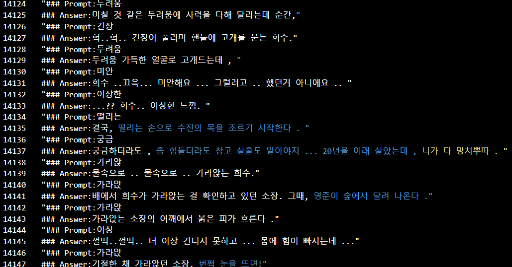

# LLM 프로젝트 결과보고서

## 프로젝트 개요

- **프로젝트 명:** 사건 시뮬레이션 시스템 > 감정기반 대본작성 시스
- **프로젝트 기간:** 2023.08.29 ~ 2023.12.12
- **프로젝트 목적:** 창작 분야에서 AI의 활용을 통해 창작 과정 혁신 및 작업 효율성 증대
- **프로젝트 참여자:** 이규범 202221014

## 배경

- **프로젝트 배경:** 창작 분야에서는 다양한 콘텐츠를 생산해야 하며, 이 과정은 복잡하고 시간 소모적이다. AI와 딥러닝 기술의 발전으로 창작 과정에 혁신이 필요하다.
- **문제 정의:** 다양성 부족, 시간 및 노력 문제, 현실감 부족 등의 문제가 있다.

## 데이터 수집

- **데이터 수집 소스:** 게임 스토리, 소설, 라이트 노벨, 영화 대본 등의 다양한 창작 콘텐츠
- **데이터 양과 형식:** 텍스트 데이터로 수집하며, 각 창작 콘텐츠의 내용을 활용

## 모델 설계

- **사용한 LLM 모델:** LDCC/LDCC-Instruct-Llama-2-ko-13B-v1.4
- **모델 튜닝:** 
- **하이퍼파라미터:** 
- **모델 아키텍처:** beomi/llama-2-koen-13b

## 실험 및 결과

- **실험 환경:** 실험은 다음과 같은 컴퓨터 환경에서 수행되었습니다.
  - GPU: NVIDIA A100-SXM4-40GB
  - 드라이버 버전: 450.80.02
  - CUDA 버전: 11.8

- **실험 과정:** 실험은 다음과 같은 과정으로 진행되었습니다.
  1. 데이터 전처리: 수집한 텍스트 데이터를 정제하고 모델 학습에 적합한 형식으로 가공했습니다.
  2. 모델 학습: LDCC/LDCC-Instruct-Llama-2-ko-13B-v1.4 모델을 직접 만든 데이터셋을 사용하여 fine-tuning하였다.

---

### Prompt Template 예시
  #### Prompt:
  {instruction}

  #### Answer:
  {output}

---

  4. 성능 평가: 시나리오 생성 정확도 및 심리학적 요소 반영 정도 등의 성능 평가 지표를 사용하여 모델의 성능을 평가하였습니다.

- **성능 평가 지표:** 실험에서 사용한 성능 평가 지표는 다음과 같습니다.
  - 시나리오 생성 정확도
  - 심리학적 요소 반영 정도

- **결과:** 실험 결과, LDCC/LDCC-Instruct-Llama-2-ko-13B-v1.4 모델은 시나리오 생성 및 심리학적 요소 반영에서 높은 성능을 보였습니다. 이 모델을 통해 창작자들은 보다 다양하고 현실적인 스토리를 빠르게 개발할 수 있게 되었습니다.

## 결과 해석

- **결과 해석:** 프로젝트의 결과로 창작자들은 보다 다양하고 현실적인 스토리를 빠르게 개발할 수 있게 될 것이다. 하지만 제한된 리소스와 데이터의 접근성 문제는 극복해야 할 도전이다.
- **향후 계획:** 더 많은 데이터 수집, 모델의 개선, 리소스 확보 등을 통해 프로젝트의 성과를 높이는 것이 중요하다.

## 결론

- **결론:** "사건 시뮬레이션 시스템" 프로젝트는 창작 분야에서의 AI 활용을 통해 창작 과정을 혁신하고 작업 효율성을 높이는 데 중요한 발판이 될 것이다.

## 참고 문헌

대본 - 필름메이커스 커뮤니티 (https://www.filmmakers.co.kr/koreanScreenplays)
게임스토리 및 소설 - 나무위키(스토리) (https://namu.wiki/w/%EC%8A%A4%ED%86%A0%EB%A6%AC)
LLM 모델 - LDCC/LDCC-Instruct-Llama-2-ko-13B-v1.4 (https://huggingface.co/LDCC/LDCC-Instruct-Llama-2-ko-13B-v1.4)
